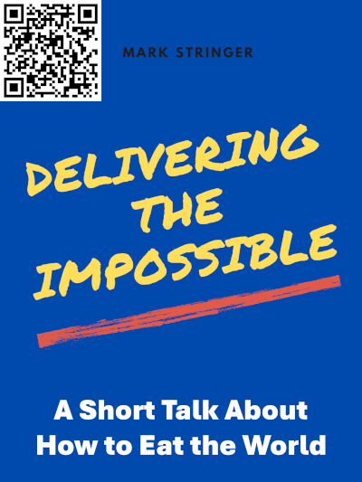

\thispagestyle{empty}
\newpage
\title{Delivering the Impossible}
\author{Mark Stringer}
\maketitle
\thispagestyle{empty}
\newpage

##  Chapter 1 - Introduction

The title of this book is "Delivering the impossible." But of course, you, or anyone, can only deliver possible things. So you might ask yourself, "Why on earth did I pick up this book? It has a contradiction, an impossibility, right on the front cover." 

Here are some reasons why you might have picked up this book. 

How about this? You are working on a project. You're a member of the project team or you're the manager, and you feel stuck. It seems like the project is impossible. Someone told someone that the project would be finished by a certain date. You know that your team can't deliver it. Or maybe you still don't know what needs to be delivered. Or you do know what should be delivered, but you're certain that your team can't deliver it on time.

In every direction, there seem to be problems that you can't solve. You have somehow found this book. You think it might be worth a read.

Maybe it isn't that. Maybe it's this. You have a group of people working on a project for you. You've got this uncomfortable feeling that the project isn't going well.  For the sake of the company or for the sake of your career, or both, you need this project to go well. You wonder if there any useful tips in this book that you can pass on. Is there anything that *you* could do to help the project do better, do well even?

Even though you think the project is impossible, you haven't given up. And it's worth asking yourself why? If the project seems so impossible, why hasn't it been killed? Why would anybody carry on with it? 

Well, part of the reason is your inherent optimism. You know that a lot of things that seem impossible can be done, given the right skills and expertise. You know this from other parts of your life. That it's not a good idea to give up immediately when things get difficult. Often things do get better if you persist. 

You also know, from other problems that you've solved in your life, that often a solution comes from seeing things in a different way. From looking at the problem from a different angle. If you can only change your point of view, things can improve dramatically. If you look at things in the right way,  they get easier to solve. If you do the right things at the right time, things that used to seem impossible can turn out to be a success.

What you would like and expect from a book titled "Delivering the Impossible" is some kind of guide.  You'd expect some kind of handbook for dealing with projects that seem impossible.

You might expect to find methods for spotting issues that make a project "impossible".  You might then expect the book to go on to talk about what to do in these situations. How to make a project reasonable and deliverable and give it the best chance of success. 

What if a project is genuinely impossible? A book called "delivering the impossible" should tell you how to spot it. And it should give advice on what to do in such circumstances. It should tell you how to keep yourself and others safe. How to get away from a lost cause and move on to do well on other projects. How to ride into the sunset to fight another day.

Well, this is that book. And it tries to meet all these expectations. This is especially that book if what you do involves the development of software.

If you read this book, you'll learn how to improve your  management of impossible seeming situations. Things might look bad. But there are often some quite simple things you can do to turn projects around and help them do well. 

### Why This?
What might be a shortened version of why you picked up this book? Because you're involved in a project and you don't know what you're doing. On the whole, in your life and your work, you would really like to feel that you *do* know what you're doing.

My experience is that knowing what you're doing isn't that different from having no idea what you're doing. You're doing very similar, simple things, but being guided by the right metaphors. And that's why this book is subtitled "seven metaphors for software development." Metaphors are different ways of seeing things. What I'm mainly going to do in this book is talk about different ways of seeing project management. 

The software pioneer Alan Kay is often quoted as saying "Point of view is worth 80 IQ points." Which I take to mean that if you can only figure out the right way to look at something, you can do much cleverer things. In this book I try to show the reader several different points of view. I talk about different ways of seeing project management. I talk about different ways of seeing, and thinking about, managing software development. 

The reason for describing these different points of view is to make good on Alan Kay's claim. The aim is to make you much smarter, to make you feel like you "know what you're doing" when it comes to managing projects.

This isn't like most books that offer to improve your success at project management. Most books that do that suggest a particular Agile method. Like Scrum, or Extreme Programming. Other books talk about how to coach teams in the use of these methods. Other books talk about a particular part of the process. It could be writing "user stories" or running retrospectives. And obviously, there are books that focus on the technical aspects of the process. 

I want to be clear here. I'm not in any way knocking those books. Some of those books are brilliant and I've referenced some of my favourites in the notes. But I don't think they're enough. 

Following an Agile method like Scrum is a good way of improving your chances of project success. It's what I almost always do if I'm in charge of delivering a software development project.

And Scrum works best when it's combined with XP engineering practices.

If you haven't done this before as a team, you are going to need some outside help.  Agile coaching from somebody who has done it before will improve your chances of success.

But unfortunately, this isn't enough. You need to do more than this if your project has any realistic chance of doing well. You need to see things from different points of view. 

For example, in this book, in the second chapter, I talk about pirate ships and "agreed activity".  I talk about how you need to be able to notice when you and your team are agreeing to ignore the big issues. These are issues that, if they aren't dealt with, will sink your project. 

Pushing this water-based metaphor, I talk about how you need to stop your team mopping the decks. Rather you need to help them to look at the horizon and face the approaching pirate ship.

Why is it important that you tackle "pirate ship" issues as soon as you see them? Because if you don't, you and your team will end up (metaphor number 2) in trench warfare. And once you're there, it's much harder, although still not impossible, to help your project do well.

Why do you need to show progress and call out problems as soon as you can in a project? Even in the face of hostility from the people who are paying you to do the project? Why put working software in the hands of people who might get some good from using it as soon as you can? 

I explain this using the metaphor of flowers and fruit. Flowers appeal to us straight away. But they aren't sustaining. Fruit is difficult to grow and even more difficult to make tasty.  But it feeds people.

Maybe you're thinking:"My software development project is in trouble. It's already cost millions of pounds. I can't any way out of this that doesn't cost millions more. The last thing that I need is some dreamy guff about metaphors." 

But this book provides its readers with something, solid, nutritious, and sustaining. It sets out seven ways of seeing projects that make successful delivery more likely. It offers the genuine possibility of knowing what you're doing. And once you know what you're doing, a lot of things that previously seemed impossible can seem a lot less so.

### Why now?
Well, another way of thinking about this is – "Why not *then*?" Why haven't we found better ways to think about software development since the start?

We've needed better ways of thinking about software projects since the 40's. The human race has been writing software for at least 75 years. We're still not very good at it, and that is because it's very hard.

I remember listening to an explanation of a "Waterfall" approach to project management. This was the mid nineteen nineties. I remember thinking "this will never work." And I soon saw that it didn't.

In my first two years as a software developer I worked on two projects. One was for a big oil company. One  was for the military. We managed both using the waterfall approach. This was the way nearly everybody managed software development at the time.  We worked on the project in stages. 

Stage one: all the requirements for the project were carefully written down. So, at the end of this stage we had a huge requirements document. 

Stage two: we turned these requirements into a design.  First we produced a high level design. Then we wrote a detailed design. 

After these stages, which might take months, we started to write software.  Again, that might take months or even years. Then came separate stages of first internal and then testing by the customer. Then and only then did the software go live.

Unfortunately, both of the first two projects that I worked on went through an extra stage between testing with users and launch. What was that extra stage? It was litigation.  When the customers finally got to see what they'd asked for, months, if not years earlier, it often turned out that it wasn't what they wanted. This was probably for a whole lot of different reasons. In the two years since they'd specified the project, it's possible the world had changed. But it's also possible that the requirements in the specification document hadn't captured what the users wanted. It's also possible the users weren't capable of saying in one single document, exactly what it was that they wanted. What the users had asked for had gone through the systems designers, developers, internal testers and then testers working for the customer. By the time that it had got to the end of that pipe,  it's not surprising that things had gone a bit wrong. But also, of course, it's possible that what the users wanted had changed.

There was one intriguing thing, that I barely noticed about those first few projects until later. When the customers finally saw the software, decided it wasn't what they wanted and threatened to sue, something interesting happened. The projects would call in a guy whose entire job was to rescue projects that got themselves into this state. He would sit down with the customers and find out which bit of the software was most important to them. Which bit did they *really* need most? He would then negotiate some room for manoeuvre. A bit of time and a bit of money from the client so that bit of the software could get built. And bit by bit, the software would start to resemble what the client really wanted. At some point it would become valuable enough to them that they would drop the threat of a lawsuit. 

And what those guys were doing, well it kind of sounds like iterative, Agile software development.

So, one answer to the question - "Why now?" Is "Well, why not ages ago?" 

We could and should have been doing this right from the beginning. And in the most extreme circumstances after a lot of time and expense, under threat of legal action, we kind of were.

So, seventy five years ago, it would have been great for us to really get the hang of delivering software projects. But still, better late than never. Because being good at writing software has never been a more important competitive advantage. Being good at doing it in a timely manner has never been more valuable. Being good at putting software that people want to use in the hands of users, has become a way of, literally, conquering the world.

As Marc Andreessen pointed out more than ten years ago, software is eating everything. Since he wrote that article, software has increased its appetite. It's taken huge bites out of sex and dating, politics, social life, music and television. Some companies are really good at developing software - Amazon, Facebook, Google, Alibaba. And some of those companies are now more powerful than some governments.

So, if you're interested in being good at something, or world domination, getting good at developing and delivering software is worth a look.

But ironically, the craft of managing software delivery doesn't seem to be so susceptible to being eaten by software.

### Why me?
So why should you listen to me? Well, I've been working in the software development industry since 1994. First as a developer, writing software for oil companies, the military and then a new-fangled thing called the internet. Then I worked as a researcher, first for Xerox, then for Cambridge University. 

Working for Xerox gave me my first experience of project management. I think they gave me the project management job because they'd seen how well I could write code. I managed a couple of guys from former East Germany who were writing code for the first "smart" phone - the Nokia 9000. These guys were some of the only people prepared to put up with how awful it was to write for this phone. They'd learned to programme on Commodore 64's smuggled over the wall into the DDR. This was a really dumb phone. It had the same operating system as some sewing machines and it was very difficult to write anything for it. But we managed to get a working prototype of our document access application. And at one point during the madness of the first internet bubble, rumours of our product was said to have put tens of dollars on the Xerox share price. Then the bubble burst.

The Xerox lab closed and I found myself working for Cambridge University. This gave me my first real experience of using iterative, user centred design. We designed a system to help school kids put together discursive arguments. The European union funding was for an interface that was tangible, an interface that you could touch, pick up. This project taught me a lot. 

It taught me that ideas evolve. We started out with brightly coloured boxes with topical ideas on them "People don't like graffiti." We ended up with a fancy (for its time) electronic interface. It used rfid-tagged cards with statements like "People don't like graffiti," to search the internet.

Whatever you're building needs to fit in a particular situation. The situation that we were designing for was English schools. They were at the time closely regulated. Any activity that we were going to get the kids to do with our fancy new interface would have to fit in a lesson plan. But because this was a research project, we were also trying to please our other research partners and in the end, our funders. I didn't think of it then like this, but that project was definitely a swamp.

Look this is all very well, but it's starting to sound a bit "I was born at an early age."

You should listen to me because I know how to deliver software projects. I've been doing it now for more than ten years. Mostly I've been successful. The projects that weren't successful were either "trench warfare" projects when I arrived. We'll talk about those kinds of projects in chapter three. Or they were projects that turned out to be things that nobody wanted. We'll talk about how to avoid those in chapters 5 and 7. Or people wanted them, but nobody could make them pay, again - chapters 5 and 7. For example, it turns out that users are quite keen on personal loan websites. It also turns out that most of the people who want a personal loan are exactly the kind of people to whom you probably shouldn't lend money. People need to keep re-learning that user research is a good idea.

Some of the projects that were successful made millions of pounds for their owners. Some of them weren't about money at all. They were literally about making the world a better place. They helped their users do scientific research. They helped their users make justice in courtrooms work more smoothly.

And I really believe that some of those projects wouldn't have done well, or might not have done so well, if I hadn't been involved.

And I learned from all of them. By working on so many projects, good and bad, my thinking about what project management was and how to do it well, changed. 

And part of the reason why I've helped these projects is that I think about them in the ways I'm going to talk about in this book.

### Why you?
Why you? Why should you read this book? Well, here's what's going to happen to you if you try to deliver a project and you haven't read this book.

What might happen if you try to deliver a project and you haven't read this book? Well, there's a good chance that you won't spot the pirate ship (Chapter 2) until it's too late. If that happens, there's a very good chance that you'll end up in a trench warfare project (Chapter 3) . It might take you far too long to realise that there's nothing you can do about it, and that you need to leave. 

Let's say you and your team gets lucky. It's members admit to themselves that there's a pirate ship coming. If you haven't read this book you won't know about flowers and fruit (Chapter 4). And not knowing about that, you might be tempted to delay putting working software in the hands of users until it's too late.

If you haven't read about the swamp in Chapter 7, there's a good chance that you won't have hired the best user research team you can find. And so you won't have a detailed map of the user and stakeholder ecosystem. Even if you tackled the pirate ship the minute you saw it there might still be trouble. Even if you pushed working software as far as you could along the right dimensions, your project might still not go well. Without a map of the stakeholder ecosystem to influence decisions, the chances are, your project won't do as well as it could. There's less chance you'll have moved from "flowers" to "fruit" and you'll have no idea what that means.

Finally, if you don't read this book, there's a good chance you're going to feel bad, even when you're doing the right things. Oh, wow, I just thought of this, if you don't read this book, there's a chance you're going to feel good, even when you're doing the wrong things.

Why? because if you don't read this book, you probably won't know about how wrong and damaging the metaphor of "Project management as keeping a promise" really is and what you can do to escape its evil clutches.

Ok - you might ask, so what would be so much better if I *did* read this book? Well, if you read this book, you would know about pirate ship that we talk about in chapter 2. This means that in the early stages of the project, as you and your team start to encounter problems, you would try to "televise" those problems. So that whoever is in the best position to solve them would be given the best opportunity. If you've read this book, you would also know about the swamp (chapter 7). So you'd have involved in your team some people who were doing not only user research, but stakeholder research. 

If you'd read this book, you would understand the importance of working software and the difference between flowers and fruit. You and your team would have been trying to "promote" working software, to get it as near as it could possibly get to hands of real users. 

In chapter 2 you would read about the pirate ship and the dangers of avoiding it. That means when you do come across a big problem that the team is ignoring, there's a good chance you would tackle it. By tackling problems early, there's a much better chance that you'll avoid the pain and misery of trench warfare. If you've read this book, you'll know about the dodgy metaphor of project management as keeping of promises. You'll be able to avoid the feeling bad when what your team delivered isn't what was initially discussed. 

And if you've read this book. Do you know what? At some point, you might just get lucky. Yes, it still needs a lot of luck. You might manage to put working software in the hands of users. And when you and your team do that they'll be guided by the stakeholder map that your user researchers have put together. You'll have found something that is not only valuable to the users, but also creates value for the organisation. Your project will be a success.

## Chapter 2 - Ignoring the Pirate Ship - Agreed activity

One of the great things about living in London is that you can sign up to all sorts of classes. Over the past ten years, I've signed up for improvisation classes over and over again.  Why? Because my experience is that every time I go to an improvisation class, I learn something new. I have new experiences, and these often, in some way or other, turn out to be useful in real life.

One of the key ideas in improvisation is blocking. For example. If an improvised scene starts with someone knocking on a door. The scene might go something like this. 

Person 1: [Knocks]

Person 2: [Opens imaginary door]

Person 1: Hello! I've brought you a cabbage.

OK, now we've reached a key stage in the drama. Because Person 2 has lots of different things that they could say. Person 2 could be happy that Person 1 had brought them a cabbage. 

Person 1: Oh you remembered that this is the week that I make all my Kimchi! Oh darling! You're so thoughtful.

Or they can be angry that Person 2 has brought a cabbage.

Person 1: And that's dinner is it? You know cabbage doesn't agree with me! Remember what happened last time. You're such an ass-hole Kevin.

The thing about both of these responses is that they move the action forward. They take someone's first idea, no matter how humble, and move it forward.

In improvisation, this is known as "Yes and." Accepting whatever your partner gives you and amplifying it. The opposite of "Yes and" is called blocking.

So for example, if we go back to what will forever now be known as the "Cabbage scene." and get Person 1 to knock again on the imaginary door. Person 2 could respond to the "offer" (as it's called) of the cabbage with some kind of bizarre argument.

Person 1: Hello! I've brought you a cabbage.

Person 2: No you haven't that's a Pomeranian poodle.

or:

Person 1: Hello! I've brought you a cabbage.

Person 2: Humph. Fine.

In improvisation classes, they teach that these aren't the kind of answers that result in an fun scene. Why? Because they "block" the scene moving forward. They don't build on it and move it forward. The poodle response is completely trying to stop the "offer" of the cabbage. It ruins any chance of an interesting cabbage story. 

What could be an interesting cabbage story? The story of two people that learn to fly on the wings of their own farts. Or a story of the dangers of living with a pot of Kimchi that brews for so long that it becomes self aware.

The second answer is "Hmph. Fine." This is even more dangerous to a good story. It goes nowhere. Again the story stops dead in its tracks. What's happening in such a situation is that the person who is speaking is feeling fear. They feel out of control, so they're doing the least that they think they can get away with. The result is very boring to watch. Also it is not very nice to the other performers and defeats the whole object of improv. The whole object of improv is to create an interesting story. But even so, the performer feels safer than if they had accepted the offer of cabbage. Because they didn't know where the cabbage might lead.

Here's another way of saying "Humph, fine."

Imagine that there are a group of performers on stage for an improvised scene.  Often to start a scene,  the actors will ask for a suggestion from the audience. Someone in the audience suggests "The deck of a tall sailing ship."

Here's what might happen.

Person 1: [Putting mimed fake telescope to their eye] Look over there! On the horizon? There's a ship, and a flag! Is that a skull and cross bones?

As with the first scene that we talked about, the other performers have a choice to make. One obvious choice here is to "yes and" the Pirate ship.

Person 2: Oh my God the Pirates are coming. Haul up the sails, let's try to outrun him.

Person 3: Oh my God the Pirates are coming. The cannons! Load the cannons!

Person 4: Oh my God the Pirates are coming. Quick hide in the lifeboats.

All these are good selections. Of course the audience hope that hiding in the lifeboats won't work, but will result in lots of comedy.

But what happens in such situations is a different kind of suggestion. Something like this:

Person 5: Hey! Let's wash the decks!

Persons 6, 7, 8, 9 and 10: Yes! Let's!

For some of the performers on the stage, this can seem like an attractive thing to do. But of course, for the audience, it's a very bad idea. Once somebody mentioned the pirate ship, they want to see it arrive. They want to see what a chase between this ship and a pirate ship looks like. They want to see if this crew can load a cannon, point it in the right direction and fire it. They want to see the pirate king and see what he'll do to the crew members who are hiding in the lifeboats.

They don't want to see everyone on the stage miming mopping the floor. 

Improvisers who don't have a lot of experience are really tempted to just scrub the decks. It is much more attractive than dealing with the implications of the pirate ship. 

Why? Keith Johnstone invented his own style of improvised theatre in the 1950's. He also wrote several books: "Impro" and "Impro for storytellers." In his books, Johnstone talks about people who are new to improvisation. He describes them wanting to do safe, repetitive activities. Washing the decks is an example of this. He refers to this as "agreed activity." 

He explains that putting people on a stage in front of an audience makes them scared. Scared people try to make themselves safe, even if what they're doing is making the group as a whole less safe. Even if what they do bores the audience.

Part of the skill of being a good improviser is knowing how to avoid this need to stay safe. Instead good improvisers have the courage to move the story forward. When they hear the suggestion, good improvisers accept there's a pirate ship. They make the story interesting and move it forward by dealing with what that means.

What's fascinating is that all novice improvisers seem to know that it's the "right" thing to do. There isn't a long discussion. It happens in a second. This is in spite of the fact that, from the point of view of the audience, it's exactly the wrong thing to do. What this shows is how good we are at shying away from things that might be dangerous. Especially, we tend to avoid anything that will make us change our behaviour or our thinking.

 Johnstone has one suggestion to help the improvisers avoid this "agreed activity". This is to have a director who is watching the improvisers and can speak out and direct them during the show.  The director spots which suggestions will move the story forward. They also see which are "agreed activity" and tell the actors to avoid them. In desperate situations she might also make suggestions herself. 

Let's say a director is watching a scene where there'd been a suggestion of washing the decks. She might allow the crew ten seconds of deck washing without advancing the action. But then she might shout "The deck's clean! The pirate ship is getting nearer and nearer! Deal with the Pirate ship!"

Why am I telling you this? Because, of course, this idea of agreed activity is useful in project management. People who work on a project can prefer agreed activity to moving the action forward. Like improvisers, they do this as a way of avoiding having to think, or needing to change. Instinctively they shy away from the realities of the problem that they're solving. 

We can start to deliver the impossible by avoiding agreed activity. We can start to deliver the impossible by spotting the pirate ships on the horizon. 

In Agile project management there are lots of opportunities for the team to spot the pirate ship. Every day there's a "stand-up" meeting. The team talks about what they did the day before, what they're going to do today. And in stand up team members talk about any problems they have that ar  blocking their progress. Reporting these "blockers" is the most important bit of the stand up. These blockers are the project's pirate ships. v

Of course, if there's one big thing that's blocking progress, that might be the thing that no-one talks about. The signs that there is a pirate ship that needs tackling might not be obvious at first. There might not be an obvious Jolly Roger flying and the sound of "Arrrrr!" 

Agreed activity might be a sign there's there's something everyone is ignoring.

If some members of the team have the same update with no variation for days and days. That's a sign of agreed activity. Another sign is when the the team plans a task and then it doesn't get done. 

Nobody on the team decides to pick it up. It may well be that no discussion has been had within the team about why they don't want to pick up this story and tackle it. As with the crew on the improvisational stage, they agreed, they might not have talked about it, not to tackle it. Of course, in these situations, it's the job of the project manager to hold up with story and ask what it is about this story that means everyone is avoiding it.

So, one place to spot the pirate ship is stand-up. Another is the retrospective. That's a meeting that happens, typically every two weeks where the team talks about how the previous sprint went. In the retrospective, the team asks these questions: what went well? what didn't go so well? what could be done better? 

One of the strange things about project management is that very often everybody who is working on a project knows what's wrong with the project. So why aren't they saying what they know? Maybe it's because they've tried to say or have said and have been ignored. Maybe they've been told to back off. Maybe they've been threatened with disciplinary action, or even disciplined for pointing it out what's obviously wrong. This is the same as if, in an improv show, one of the performers shouted "Look! A pirate ship!" and a director sitting next to the stage responded by saying "Shut up about the pirate ship! I don't want to hear any more of this negative thinking. Clean the decks! Any more talk of a pirate ship and you're off the show." 

A leader doesn't need to tell the team to shut up about the pirate ships and clean the decks many times. Once they've done it once or twice they will have already caused one of the strangest problems that I've seen. And I've seen it repeatedly: highly skilled, highly paid team who've given up trying to think for themselves.

No matter how many times they've been beaten down, a team will still respond to the right kind of opportunity to feed back. If you run retrospectives and give people an opportunity to speak, they will speak. They will talk if they think  you are listening. They will notice see and appreciate you doing your best to raise their problems with the people who need to know about them and can fix them. And sooner or later, they'll talk about the pirate ship. When they do, it might be hard to keep your jaw off the floor. 

I worked on a project that was really struggling. We had a retrospective. 

One big problem emerged. All of the requirements for the project were written by a single business analyst. They didn't amake any sense to the team. The team's main struggle was making sense of what the business analyst had written in the requirements document. 

What struck me straight away was that the business analyst wasn't in the retrospective. In an agile project, the business analyst is part of the team - they're not supposed to be outside of the team throwing in requirements.

So my response to this problem was to suggest that they business analyst should be invited to stand-up meetings, and the planning meetings. And retrospectives and show and tells. This was where the developers looked at each other sideways - this is always a sign that you're finally getting to the real issue.

"We're not allowed to talk to the business analyst."

"What? That's mad! I'm sure that can't be right."

Yes it was mad. Yes, it was right. Well, it was what was actually happening. 

I tried to talk to the business analyst. I emailed him asking for a meeting. I got a phone call from his boss saying I wasn't allowed to talk to him. 

And of course, there was no way that the project was going to get anywhere in its current state. The team needed to talk to the person who could tell them what the product was supposed to do.

Side note: This project was worse than it sounds. It turns out there were *two* groups of business analysts. There were "technical" business analysts. But there were also "business" business analysts. The "business" business analysts were actually allowed to talk to the "business" - the people who wanted the product. The technical team was only allowed to talk to the "technical" business analysts. And these two groups of business analysts - technical and business -  also weren't allowed to talk to each other. They were only supposed to communicate via emailed word documents. A big part of making this project possible was to make sure that we had just one business analyst. I don't know whether in the end we designated them as business or technical. I'm certain I was asked. This person was allowed both to talk to the people who wanted the software and the people who were building the software. And sit with the team who was doing the work. So they could ask him questions. I mean imagine.Things got a lot better after that.

So we've talked about stand up meetings and we've talked about retrospectives. There's one more Agile meeting where the "Pirate Ships" that are on the horizon might be detected. And that's the "Show and Tell." The "Show and Tell" is a meeting where the development team show the outputs of what they've been working on in the last "Sprint" - typically two weeks. Who do they show it to? Definitely you should show it to the product owner who is supposed to act as a representative of all the people who want the project to happen. But you should also invite other people who are interested and who want to come along. 

After the minor victory of getting the business analyst to sit with the team, I then suggested that we start to have show and tell meetings. Fraud was an issue that affected  people who worked for the bank all over the world. So for the first phone conference I could hear just from the accents the geographical spread of interest. There were Northern Irish accents, Scottish accents. But there were also Cockney-sounding Southend accents and Indian accents from the offshore call centres in India.

In that week, the team had been doing some work on the user interface for one of the very early screens in one of the fraud detection journeys. 

One of the developers put up the login screen and then clicked through the first screen and started to talk it through. Even though most people who were on the conference call were on mute, I thought I detected some kind of change in the silence. Finally someone on the line with a cockney accent said:
"Erm, I thought we'd agreed that we were going to arrange cases by account name rather than by account number?"
The developer who was demoing the screen looked blank.
The business analyst who we'd only just set eyes on and had only just joined the team started to look worried. 
"No, it's in the requirements that cases should be arranged by account number."
"But that makes no sense" someone with a Northern Irish accent joined in.
"It's people who are victims of fraud, not just individual accounts"  added someone with a Glaswegian accent.
"We need to see all the accounts that someone holds, and see the activity across all of them for this to make any sense," said someone with an accent I didn't recognise.

Yes, that's right. The structure of this project was wrong from the very beginning. This problem hadn't been detected through months and months of analysis. But it took just five minutes of putting the working software (OK, I'll admit, it was only a front end) in front of the people who might use it had found the problem.  

If you do stand-ups every working day with your team, if you do retrospectives and show and tells every sprint, you will find out what the problems are. Even if you do these things *badly* - you will still find out what the problems are. Not having stand-ups, not having retrospectives and show and tells is just like shouting "Scrub the decks, don't look at the pirate ship!" at your team.

So, what does understanding this idea of "agreed activity" mean for our overall aim of delivering the impossible?

Well, it means something simple. If you work to discover the problems that your project is facing you will find them. If you then work to solve those problems, you may well be able to transform projects that seem impossible into projects that are possible. This gives you the best chance possible of actually delivering them.

This seems so obvious as to be laughable. Why then, in project after project have I found teams that aren't articulating their problems and aren't tackling them? In improv terms the teams aren't looking at the pirate ship. Why? Why aren't they doing what needs to be done before it arrives? Why are they washing the decks? Why are they making potentially entertaining improve shows boring? It's the same impulse that makes diffiucult but possible software projects impossible.

Why? It's simple. Because problems are scary. Problems are humbling. Problems cause the ways in which people don't agree to come to light. Professional people who are hired to do a job are supposed to be able to do it aren't they? What does it mean if they openly admit that there are parts of the job that they can't do? Maybe it means that someone hired the wrong people.

Highlighting the problems that starting to do a project shows up can be threatening to the sponsors of a project. What if the problem that you find is something that they haven't thought of and they don't know how to fix? They will be tempted to avoid addressing it, possibly by attacking or threatening the team for even daring to raise the issue. 

Too, too often, when someone on the stage shouts "Look a pirate ship," It's the director off stage that shouts something like "You're wrong, it's not there." 

Other ways of saying this that are just as bad are "I'm tired of this negativity," or "Maybe you're not up to the job if you think that's a pirate ship."

And that's why people don't raise problems and instead just wash the decks.

Oh dear. Well. There is a good chance that you picked this book up because you wanted to deliver what seems to be an impossible project. I'm keeping my word. But notice I'm not saying that I'll show you how delivering these projects is a walk in the park or a day at the beach. It might not be.

Dealing with the problems that you find and making them clear to your team and your sponsors can be a rough ride. It can be hard to stick to it. It needs an ability to talk about the real problems. It also needs the ability to be understanding when people call you not very nice names. But there there are two very good reasons why you still should do it.

Reason number: solving these problems is still the best chance you've got of delivering this project that seems to be impossible. That's a solid and compelling reason.  

But reason number two is possibly for me, just as important: I know what happens when you don't.

## Chapter 3 - Trench Warfare

Two members of my team were supposed to be putting their software on a clients machine. They'd written a script to run on a clean machine that would put our software where it needed to be. They'd tried the script on a practice machine. It had run without any problems. They kept trying to run the script on the client's machine. It kept failing.

They ran some diagnostic tests. The machines that they were putting the software on were supposed to be clean. But running the tools we had to check for problems, it turned out that they already had other software running on them. When the pointed this out to the people who were supplying the servers, they began to act very strangely.

It was a Sunday afternoon. And I was in an emergency meeting. The topic of the emergency meeting had been what we were going to do about the failure of my team to load our software on the clients machine. The client was implying very strongly that the reason we'd failed was because our guys weren't up to the job. Just like the guys in the server room, when I brought up the subject of other software already running on the servers he became evasive. He moved the topic of the emergency meeting onto what we should do about our four o'clock emergency meeting. Our three o'clock emergency meeting had overrun so long that we were now in it.

Ultimately the mystery of server software already running on the supposedly clean servers was solved. The company that were providing the servers were in some kind of dispute with the organisation that wanted the project. While they were in dispute, they were working to the letter of their written agreement.  The agreement mentioned so software that should be installed. So they were providing servers that already had this software loaded, even though they knew it would break ours. That's part of why they were behaving so oddly. But the other part is that the written agreement to provide the servers was officially secret. So even as they saw our guys failing, and they knew why, they felt they weren't legally allowed to tell us. As the great philosoher James Brown once said "I don't know karate, but I know kerayzee?" And that's what this was. Crazy.

Eventually we found out. Eventually it was admitted that there was no chance that the project could go live that week. I left the project the next week and never heard of it again, I'm certain it never delivered.

I'm going to use the term "trench warfare" in this chapter. And I'm going to use it to mean any project which is going to fail unless it is set up, stuctured and managed is changed. Why are we talking about trench warfare now? Because in the last chapter, we were talking about pirate ships. Yes, I know, I know, I'm mixing metaphors. 

What I mean by trench warfare is any project that is hugely expensive in terms of money, effort and human suffering and doesn't get anywhere. A main cause of trench warfare is a refusal (or active prevention) earlier in the project to deal with the problems that it faces. The main effect of this is pretty much guaranteed failure. But on the way to that inevitable conclusion, there is more and more strident demand for "agreed" activity. Activity at almost any cost, no matter how frantic, pointless and damaging it might be.

Working late. Working weekends, holidays being cancelled or frowned on,  "a positive, can do attitude" are signs that you're working on a trench warfare project. Other signs are lots of staff leaving drinks and staff being signed off long-term sick, or with stress. Ex members of staff bringing lawsuits against the company, this is also a bad sign.

I must confess, I still haven't found a way of remaining calm when I get a certain kind of complaint from senior management. The complain that the team isn't looking stressed enough.

A trench warfare project is a bad situation. Experience of working on one can be one of the best reasons to get over your reluctance to tackle issues as soon as they come up. Once you've worked on a trench warfare project, you might be much keenr to call out problems the minute you see them on your next project. But every now and then you are going to find yourselves working on a project which is working towards a ridiculous, undeliverable deadline. At the same time this project will struggling with several other problems. This is a very common kind of undeliverable project. 

I don't know if the real life Jerry Springer actually said this or not. But in "Jerry Springer the Opera" the character of Jerry Springer says something that has stuck with me ever since: "I don't solve people's problems, I televise them."

If you're working on a trench warfare project, that's exactly what you should be doing. Sure, go one better than Jerry, and solve the problems that you can solve, but the problems that you can't solve? Broadcast them. Make sure everybody on the project knows what those problems are.

Why? Because someone else may, if they want to the project to succeed, be able to solve them. Another way to look at this is to look at some of the people who are giving you and your team a hard time. Those people who are saying that you're team don't look worried or stressed enough. Those people who are saying that your team don't care about the project because they took the whole weekend off. It might be that some of those people are only doing those things because they have no idea what else they can do. They want to make the pproject more successful, they just don't know how. If you make clear what the problems are that your team is encountering, you're giving those people who want the project to succeed more chance to help.

The second thing that you can do is to deliver something to some of the people who want it. This might not be anywhere near everything that's been asked for by the deadline. But if you can find one bit of software that you can release to some people who want it, you can completely change the nature of a project. Pull from outside a team that comes from demand from real users is a truly wonderful thing. 

Thirdly, one of the most revolutionary things that you can do, is to track and show the actual progress. This might be tough, but few things are as powerful as showing actual progress relative to the project's needs and expectations. In a way this is just a more extreme version of the "Jerry Springer" principle. This is one of the most powerful manoeuvres that I think an Agile project manager has in their toolbox. We'll go through it in  detail, well at least one way to do it, in a later chapter.

Demonstrating that a project can't be delivered by a deadline can result in sensible discussions about reduction of scope. This can then, sometimes, result in delivery of a small bit of working software to some of the people that want it. It may well seem that a project is dug-in, going nowhere and doing nothing but damage to the members of its team. But it's still worth doing these three things. Be honest about problems the project is facing. Track actual progress. Push as hard as you can to get working software in the hands of end users. 

It might be that something could be done to save a trench warfare project. But equally, it's important to remember that some projects cannot be saved. I don't think I've ever worked on a project that was being deliberately targeted to fail, but I have heard talk of such projects. 

It is quite important to understand that you don't need to stay on any project that is failing. The people in the real trenches had to stay. If they didn't they'd be shot for desertion. You don't have to. Paul Simon points out that there are multiple ways to get out of a difficult situation. There might not be as many ways of getting off project, but there are certainly a good few.

Of course, you can just find a new job. When you start to look you might be astounded to find that you're not the only person on that project who is looking. Recruiters have a very good idea about which projects are going badly.
 
## Chapter 4 - Flowers and Fruit
This is an idea that I picked up from reading about Taoism. There are two ways that you can get paid.

You can get paid for looking good and you can get paid for doing good. In Taoist terms. Getting paid for looking good is "Flowers" and getting paid for doing good is "Fruit."

Don't get me wrong. It might seem as we go through this chapter that I'm down on flowers. I'm not down on flowers. Flowers are great. In project management, the part of flowers is played by ideas. 

People have ideas, those ideas get money and that's how projects are born. Something that some ideas and most flowers have in common is that people like them straight away. They don't have to think about it. It doesn't take any thought to like a rose. Of course, some people might not like roses. But the people who do? They don't have to take time to work it out. 

Something similar seems to happen with some ideas. The kind of ideas that get money to turn into projects seem to have a structure that makes people like them without too much thought.  Just like flowers, those who are exposed to them tend to like them without doing much or any thinking.

Often this is in terms of easy, fast, cheap, same and all.

For example - "Does everything that the old system does, but cheaper and faster."

"Deals with all customer enquiries, without the need for human involvement."

"One stop shop for everybody who is trying to do this job."

Just like flowers, ideas get paid for being attractive to people before they even think about it.

What about fruit? What's the difference between fruit and flowers? It isn't that they are hard to grow. There's lots of effort involved in growing both. And although it might *look* easy to put together an attractive idea that can gets money. Clearly it isn't. If it were, everybody would have managed to get money for their project. 

No, the difference between fruit and flowers isn't that one is easier to do that the other. The difference is that the fruit has to actually be eaten. The users of fruit interact with it in a completely different way to the users of flowers.

Users eat fruit. The only look at flowers. Nobody ever died from looking at a flower. A sour apple can give you bad indigestion and some fruit is actually poisonous. 

Similarly, implemented, delivered projects have to actually give value to their users. This involves an interaction with users which is different from buying and selling flowers. User have to actually get some good, some value out of using a software product. What 'good' that value, is, is different for different kinds of products. For example, it's very different for a social media product than it is for a government form. But like fruit, the process of "using" software for users is one where, if it doesn't taste right, they will spit it out. Also like fruit, if software isn't looked after properly, it could do them harm.

To be honest, I wish I were able to cite some other reference in support of this idea of "flowers and fruit" than a 2000 year old text. 

But this has to be an important part of what managing any project is about. All projects need to move from "flowers" to "fruit". All projects start out as just ideas. The idea must have had some superficial attraction, because it got funding and resources. But for the project to succeed it needs to be moved to be "fruit". It's value needs to be not just superficial, but also fundamental. It needs to be sustaining. It needs to be something that people consume and get value from using.

What makes this so hard? Well, one of the things that makes it so hard is the nature of project ideas that we talked about. What makes project ideas attractive - the kinds of things that get money -  is that what makes them liked doesn't require conscious thought. Often what makes people like things straight away is that they don't require much thought, but they do suggest some of these features: easy, fast, cheap, same and all.

The problems start when anyone tries to implement the idea. This is especially a problem if someone tries to implement the idea using one of the more "modern", Agile project management methods. One of these methods is Scrum.  In Scrum, team members meet at the beginning of every work day and talks about what they did the previous day. They also talk about what they're going to do today. And they also talk about anything that's stopping from doing what they want to do. They do this every working day. If they're all in the same building, they tend to do this standing up, to deter the urge to just end up chatting. This is called the "stand up."

Once every two weeks, the team shows the work that it's been doing in the last two weeks.  The audience is made up of people in the organisation and also sometimes also users from outside the organisation who are interested. This is called the show and tell.

The team also has a private meeting where they share what went well, what didn't go so well and what they might try differently.

Can you see yet how there might be problems for the "Flowers" aspect of a project? This idea that people liked without thinking to much about it? The minute that a team starts to implement the idea of a project they will get problems. And if the team is using an Agile way of doing things, like Scrum, those problems will start to be reported. Right away. On day one.

So? What's the problem with problems? The problem with problems is that any problem that the team finds is like to take the shine off the idea. Any problem that the team finds is likely to make the idea look harder to do, slower, more expensive, different and partial.

So, this is the problem at the heart of project management and project development. It's one that I wonder people don't talk about more.

>> Nothing makes a project appear less attractive than actually starting to do it.  

So what can be done? To solve this problem? What absolutely must not be done, as we discussed in chapters two and three, is to avoid the genuine problems that the project is facing. That way failure or possibly trench warfare lies. 

The project is entering a vulnerable, cold phase, where it is not supported and valued for the appeal of the idea. This because we are starting to find out what is wrong with that idea. At the same time there is no support and value for the reality, because there is no reality. We don't have anything to show yet.

As someone who is trying to help this project get delivered, it is important to do two things. Firstly, it's important not to avoid the move of a project through this phase. This is what we talked about in Chapter two, when we talked about agreed activity. It's also what we talked about in Chapter three. A project can get into an awful state if the problems that agreed activity is there to avoid aren't tackled. 

So, someone who wants a project to do well shouldn't do anything to stop it moving into this phase. At the same time, you should know where you're going and what kind of things can should be done to get you out the other side of this phase.

OK, here's where it gets even harder. There are two kinds of thing that you should be doing to get the project through this tough phase and on the road to success. And here's what makes this hard. Both of the kinds of things that you should be doing aren't often popular or well-recevied. They are the kinds of things that the sponsors of a project are likely to think of as either a pointless waste of time or the kind of thing that should be stopped. 

What are these two things? Stakeholder research, which I'll talk about in more detail in the next chapter, and working software.

What do I mean by stakeholder research? I mean developing a good understanding of who is interested in the product and what their interest is. Notice here that I'm not saying "user research." That's because stakeholder research doesn't just include users. It also includes other individuals, organisations and interest groups that might be interested in the product.

As a seasoned and grizzled project manager I'm very careful of statements that involving or implying "all".

So I won't say "find out as much as you can about the people who are paying for this project." But your project will probably benefit from you knowing more than you would if you didn't do any research. Similarly I won't say "find out everything that you possibly can about your users." But you should certainly be doing enough that you start to hear things that you've already heard from multiple users.

But I can say this. You need a strategy for mapping the ecosystem of stakeholders. You need a strategy for investigating the needs of users. You need a way of taking what you find and using it to inform what goes into working software.

So how do we do this? How do we achieve this move? From "Flowers", where value and support for an idea comes from the idea itself to the "Fruit" where value and support comes from a real working piece of software.

## Chapter 5 - Working Software

>>"sufficiently advanced technology is indistinguishable from magic" 
>> Arthur C. Clarke

### Concept
In the Agile manifest, working software is talked about as the second key value.

>> "Working software over comprehensive documentation."

It's worth asking. Why? What was the experience of those guys who got together to talk about "lightweight" software methodologies. What had they lived through that meant that in the final 93 word manifesto, working software took up five of those words. 

My guess is that they had all had experience of being involved in projects where the production of working software was delayed. They worked on projects where months or years could go by before the specification was agreed.

For the first forty or fifty years that software development existed, that's how people thought it should be done.  Software development was called software engineering and it was thought to be an offshoot of other kinds of engineering. And in other kinds of engineering, nothing is built before the production of detailed plans. 

But what is this second principle in the Agile manifesto saying? It's saying the engineering equivalent of "have a go at building a bridge and see how you get on."

So why? These guys got together for the express purpose of making the way that software development better. Why would they want something about working software in the manifesto?

OK, let's make this about you for a minute. Think of something that you know a lot about. There will be something. It doesn't have to be anything to do with work. But think of something that you know how to do. OK now think of some aspect of that thing that someone who wasn't an expert would think was strange about how do this thing. Why do you do that thing?

There are at least a couple of possible answers. Maybe you were taught to do this thing by whoever taught you. Maybe it's just your own way of doing things. But there's one answer which is very likely and very compelling. You do things in this way because you've seen what happens if you don't. You've learned the hard way.

And I totally think that that's the reason why "working software over detailed documentation" is in the Agile manifesto. And this is a very similar reason to one that we've discussed when we were talking about avoiding agreed activity. Why was I pushing to avoid agreed activity and work with the team to tackle whatever the problem was that was looming on the horizon? Well, there are lots of good reasons, but one of the main ones, was that I've seen what happens when you don't do this - trench warfare.

I think it's absolutely the same reason that working software is one of the four main things that are discussed in the Agile Manifesto. The people who put it there have seen what happens if you don't push for working software. But when it comes to working software, it might also be that they've seen the good things that can come from producing working software.

### Conclusion
I think there are three main reasons why software development teams should try to develop working software sooner rather than later. 

The first reminds me of a joke.

>> You will never be alone, if you take with you everywhere the ingredients and equipment to make a dry martini. Even if you think you are completely alone and stranded on a desert island. The minute that you start to make the dry martini, someone will jump out from behind a tree and say "that's not how you make a dry martini."

Something like this is true of developing working software. Ideally you want your software to be on the environments where it's going to end up. You want to be accessible by real users. You want them to able to use their real data, on the real software. But the nearer you get to doing that, the more likely it is that people that you didn't even know existed will jump out from behind trees. These people will tell you that "you're doing it wrong" and try to stop you getting working sofware in the hands of users.

In my head, I always imagine the job of getting working software out in the world on a working environment like trying to escape from a prison camp. There's only one way to find out what all the traps are that are out there in no man's land, and that's to try to set them off. 

I'm mixing metaphors again aren't I? Let's stick with the man behind a tree for a moment. Most of those things that the man who jumps out from behind a tree will bring up what are known as "non functional requirements." The software needs to be accessible. The software needs to be secure. The software is covered by some regulator in the industry that you have never heard of. 

One way to tackle all the rules and regulations that your software might contravene is to try to take care of them in the specification.  Before any software gets written you might try to think of everything that might possibly be required. But in my experience it's very hard to find out exactly what you can and can't do without trying to do something. We can guess that the framers of the Agile manifesto had had similar expereinces. 

When you're trying to list these requirements without a piece of working software, you're only dealing with "known knowns". When you try to get some working software as far as you can through the barbed wire to the outside world, you soon start to find about "known unknowns". You knew there would be other security measures out there in no man's land, but you didn't know what they were. But also when you start trying to put working software in the hands of users,  you find out "unknown unknowns" (like the guy jumping out from behind a tree). 

OK. This metaphor is getting very mixed. And it's got a lot of trees in it. 

But this is the slightly counter-intuitive thing I'm trying to tell you. You should try to get working software as near as you can to live? Why? Because if you do a man will jump out from behind a tree and tell you why you can't.  The only real way to find out what there is in no-man's land that's stopping you and your software from escaping is to push your software through it. Let's move on to the second reason why trying to create working software is a good idea.

The second reason is this, we might call it the "there's only one way to find out," reason. How do you find out if you can do something? By trying to do it.

There are lots of rules and regulations relating to - well - everything, it seems. And software is no exception. Rules about security. Rules about hosting. Rules about performance. In software, this red tape is often called "non functional requirements." And you software might get stopped dead in it's tracks by someone wearing a metaphorical peaked cap because it doesn't meet of these. And we'll talk about these "non-functional requirements in more detail later. But I'm not talking about those just yet. This is more straight-forward than that. These are the simplest questions that trying to get working software answers.

Is your team capable of writing this software?

Does your team have access to the tools and resources that they need to write this software?

Does the technology that you've decided to use work?

Is the organisation that you're working for capable and willing to pay for the servers, people and set-up that you need to deploy this software?

Well, there's only one way to find out the answers to these questions and answers might not be the one that you're hoping for. I've worked on teams where the team members don't have access to the office. I've worked on teams that don't have access to the internet - "To make internets, you need internets," one developer was forced to explain. Of course these are problems that can be solved, but only once they're uncovered. 

So, this is the most straight-forward reason why a team should be trying to develop software as soon as possible, because there is only one way to find out.

But there's a third reason. Software is magical and the way that people respond to it is magical. People don't respond to working software in the way that they respond to feature lists or specifications.

Think about it. Think about the pieces of software that you interact with every day. Are you thinking about them in terms of lists of features? When you're using some piece of software, you are using it to do something. You have other things on your mind. A funny joke that you want to share, a report that you want to write or a podcast that you want to listen to.

And this, final reason is the main reason that it's useful to try to move a project towards delivering working software earlier rather than later. By putting working software in the hands of the people who will use it, you start to solve the flowers vs fruit problem that we talked about in the last chapter. 

When you put working software in the hands of users, you move the discussion. You move the discussion and the dynamic of the project away from flowers. And it isn't just the discussion, it's the actions. The focus isn't any more about the shiny list of things that a piece of software might do. Now the discussion is about fruit. What does the software actually do? Now that it's in people's hands, does it do something that's useful for them. What can we do to make this thing that users are already using even better?

I worked on a project for an organisation that was still doing pretty much all of it's business using paper documents. This was a huge organisation, and it processed a lot of paper. The project that I was working on looked at just one of these paper processes. The aim was to take it over and make it manageable it using an electronic document handling and storage system. 

And the project had a couple of good things going for it.  Firstly it was using an Agile way of doing things. Secondly, the product owner was a former clerk of the company, she new all the other clerks and she knew their business very well.

To start with the project had a tough time. We could get servers to put the software on. The document package we'd chosen wasn't as mature as we thought it would be. But we pushed on through some early design iterations. We dealt with a load of technical problems. Finally, we got to one show and tell where the team had working software that they could show.

It was an odd turning point in the project. Because that first demo was so terrible. We'd managed to pare down the what this demo did to a view of a collection of documents and then a display of the document when its title was clicked.  In that first demo, when we clicked on the document link, a window came up that said "Do you want to veiw your document?" Yes, with that spelling mistake.  And then when the user clicked "OK" an error message appeared.

The look on the product owner's face! At this point were were about £500,000 into a £2 Million project. And all she had to show was a misspelled-spelled but that led to an error message. It was a hard time for her and it was a hard time for the team.

But two weeks later it was a slightly different story. Now there was a list of documents. Now when the document was clicked, the chance to open the document had a button that was spelled correctly. And when it was clicked, the document was displayed!

The product owner seems a little bit more relaxed.

Not too many show and tells after that the product owner had a question. "Can I get this on a laptop so I can show it to the clerks?"

The short answer to that question was "no" because all of this nearly half a million pounds worth of software was deployed only on developer laptops. But the product owner's request to have a version that she could take around the country and to show off was a powerful help. It provided a good extra reason to negotiate with the people who were supposed to be giving us server space.

Once that was in place, the product owner went on the road with her laptop. The demo still wasn't much. The demo still had bugs. We still had some spelling problems! But the demostration by the product owner to her own former work mates went very well. She could wave past any user interface issues, or problems. She could show her the other clerks the first sight of something that could make their lives a lot easier.

She came back with a list of problems she'd come across while using the demo. She also had a list of suggestions for features that had come from the clerks. But the main question that she came back with was: "When will it be ready?"

From that point on, the nature of the project changed. It wasn't about delivering on a list of functions. It was about rolling out to the clerks all across the country the tiny bit of working software that the product owner had shown them. After that, being clear to everybody about what was needed next and when we could implement these next steps.

There was another very interesting thing about getting some working software in front of the people who might use it. By doing this we both asked and then started to answer the two questions that I've already talked about. "Can we do this?" and "Who is going to jump out and stop us if we do?" 

To the first question, the answer at first was "No." We didn't have any server space where we could deploy a live service. This was blocked because of a dispute. The price of providing and supporting the servers was not included in the contract. But the client was arguing, that they shouldn't have to commission the servers. Neither should they pay for them or support them.This became a much harder argument to make once people in their own company were asking for the software. Suddenly they people who were trying to negotiate free stuff were in the way. Now they weren't helping the company by being tough on costs. Rather they were stopping people who worked for their organisation from getting something they wanted. Something that could make their lives easier. Suddenly the servers appeared, and then money for staff to support them appeared. A real roll-out of the software started to happen.

To the second question "If we try to do this, is anybody going to jump out from behind a tree and stop me?" The answer was "yes." In fact two people jumped out. An accessibility guy and a security guy. The accessibility guy claimed the there was no way the software could be released until it met a extra set of requirements. The client claimed that we should have know about these requirements right from the start and so we should pay for them. 

And by the way. This guy was pretty much right. We should have built in accessibility right from the start. It takes no more effort in coding to make sure that a website is accessible.  And it actually makes the site much easier for all kinds of people to use. People who you might not think of as disabled? Do it. It makes sense. If in doubt, pay a blind guy to look at your site.

Out from behind another tree jumped the security guy. He said that the project should never be allowed to go live until we could prove that it was secure. Just to leave us in no doubt about his effectiveness as an blocker, he also refused to tell us what it was we needed to change so that it would be secure. And of course, the costs of any changes we made needed to be born by us rather than the client.

As people who jump out from behind trees trying to block progress go, these two looked pretty effective. Both were telling us we couldn't release until we did what they said, both were telling us that we had to pay to do what they said. The security guy was being even more effective at blocking us because was also not telling us what it was we had to do.

But neither of these guys was a match for the clerks. There were a lot of clerks. They'd seen that this software would make their lives much easier. We improved the accessibility, but we went live with what we had. We submitted the software to outside security testing. We addressed some issues, but we went live with some others still being looked at.

Putting bad, barely working software in front of real users completely changed the project.

### Connections
Showing barely working software to the clerks had created this magical thing. It's a thing that gets talked about when people talk about different ways of doing Agile. Ways of doing Agile like Lean, which is Agile, but for manufacturing. What is this magical thing? It's called "pull".

You may have heard the saying "just in time." It's a strategy for managing supply chains in all kinds of industries. One industry that has perfected this approach to managing its work is the Japanese car industry, and particularly the Toyota car company.   
The Toyota company succeeded because from the start it understood one thing. The realised it just wasn't possible to make cars in Japan in the way they were being made in the 1920's in America? Why? Because Japan's economy at the time was tiny. It went in cycles of good and bad times. So from very early on, Toyota matched the rate that it made cars to the level of demand for cars that it saw from the market. Over nearly a hundred years, that process has become very sophisticated. The result is that many different kinds of cars, with the many different extras that modern cars have, can roll off the production line of the same plant. The cars that come out of the factory almost precisely match the demand outside it.

Each car is *pulled* off the production line by a specific request for a car which comes from a dealer, which in the end comes from a customer.

Thinking about things in terms of providing value to the customer results in another important idea.  Again, this is clear from the way that Toyota do things - waste.  In Toyota's way of thinking. Anything which money has been spent on, which isn't on it's way to a customer, is waste.

If you put these two ideas together: make things in response to demands from customers and don't have anything hanging around the factory that isn't on its way to customers, you end up with a process that fits the label that have been applied to it in the west - lean.   It also fits the other name that is often used - "Just in time."
 
It's important to point out that making cars is *very* different from making software.  It's also possible that reports and descriptions of how the Japanese, and especially Toyota, make cars aren't that accurate. Maybe that's the way Toyota used to make cars. Maybe that's a lot different from how it's done today. 

Even so, taking these two ideas - only deliver things which the user wants and don't do anything which isn't going to either directly benefit the user is powerful. These two ideas are two sides of the same coin. If taken seriously, they are a powerful way of making projects which seem impossible start to suddenly seem possible.

### Concrete Practice
So how do we do this? Every project is a little bit different. But I'm going to arbitrarily invent a rule of sixths. This feels about right. If you think your project is about 6 months long. I'll give you a month to do some set up. If after a month you and your team don't have *something* that works, you've waited to long. By the end of a sixth of the time, you need tiny piece of working software. A small bit of software that starts to do the thing that it's supposed to be doing. And you need to be able to show this software to the people who will finally use it.

And once you've got this tiny little thing, you should be looking to improve its status in some way. And there are lots of ways to do this. Sure, add functionality. But if this first working version will only run on a laptop, that's not the first way to go. Just as in the example that I gave. If you've got an example that works on a laptop, then one good move would be to show it to users. Another would be to move what's on the laptop to test servers and beyond that, to the live servers where it will eventually be used.

What's so important with working software, is not so much what you've got, but that you've got something and it's moving in all the right directions. Sure it needs to be increasing in terms of what it can do. But it also needs to be moving from developer environments, to test environments and onto live environments. And it needs to be moving from being tested by the team to being tested by "friendly" users to being tested by complete strangers. If it's a business application, it needs to move from using dummy data, to using data that looks like live data, to using real data. 

I know nothing about rock climbing. But this is a little bit like if you're climbing a huge rock face. You climb a bit, then you put in one of those things that holds the rope to the rock. Then you pull on it, to make sure it's firm and would hold you if you fell, then you can climb a bit more.

Yes, delivering software is a bit like that. It's a bit like climbing a rock face. The odd thing is how many people think that you can get to the top without a rope - but also, without the climb!

Gradually developing working software in all of those directions is the careful and effective way to deliver something. Especially if that something seems impossible. And if the thing that you're doing is in any way useful or interesting to the people who will use it, at some point you will start to get "pull". Obviously, you'd like this sooner rather than later. But at some point, you will start to get demand for the software. And then you will start to get emand for functionality from the software. Not from the people who sold the idea - push - but from the people who are likely to use it - magical "pull".

Gradually developing software in these directions will also result in people jumping out from behind trees.  They will helpfully provid you with extra rules and regulations that you need to follow. You will need to negotiate these before your software can finally escape and live free in the real world. Push working software as far as you can towards being live with real users. It's the most powerful secret to actually delivering things that seem impossible. And everybody, or nearly everybody, will try to stop you doing it.

What? Yes, that's right. Incrementally delivering working software is the thing that you need to do. It's the thing that's most likely to help your project succeed. Still, nearly everybody will try to stop you doing it. 

How? Why?

OK, let's deal with the how and the why, but separately.

How? Developers will tell you that there's no point breaking big bits of functionality into smaller bits.  Even though, if they did do this, those bits could be shown, released and tested sooner. They'll say that it "only makes sense" to release some bit of functionality in one big piece.

How? Somebody will tell you that there's no point troubling users with small bits functionality.  They'll tell you that users only want to see the whole, finished, journey. They'll tell you that showing them anything sooner is a waste of time and money. 

How? Some users will tell you that there's no point looking at the new system until it has their real data in it. Or they might not want to see it until when they press the "launch missile" (or business equivalent) button and something actually happens.

How? Somebody will tell you that test servers are expensive.

How? Somebody will tell you that the live environment is only in the budget from the week before the project is about to finish?

How? I've been lucky, and there are some noble exceptions. There are some great product managers. The main responsibility of a prodcut manager is to decide the relative importance of the different things that the software should do. But so many of them try to avoid it. They will utter the magic, tragic words "we need it all, so I don't think it's important what order it gets done in."

But why? Why don't people want working software?

The reason people don't want working software is something we've already talked about. Well, it's very similar. It's very similar to the reason that the improvisers that we talked about in Chapter 2 don't want to deal with the pirate ship. Without having to think about it, people know that dealing with working software or a pirate ship will mean that they have to *change*. They will have to change what they think. They also might have to change what they do.

The other reason is that trying to get software working attacks the "Flower" of an idea. This is the aspect of the idea that people think is good even, without having to think about it. These are the aspects of ideas that tend to be of the form "all", "same", "faster", "cheaper." 

Trying to get even a tiny bit of software working tends to undermine those aspects of an idea. If just getting *something* to work, takes so long, and that something is so slow and has cost *how much* money? Suddenly the idea doesn't look so shiny and appealing.

And what about the people who jumped out from behind trees and told you couldn't do things, or you shouldn't be doing them that way? Nobody wants to see them. Nobody wants to deal with whatever extra requirements that they place on your project. Especially the people who got funding for the idea. 

Yes. Moving towards working software does a whole lot of things that in general people want to avoid. It throws up a lot of technical problems that require thinking. It throws up a lot of rules, regulations and restrictions about what can and can't be done that require even more thinking. It makes obvious how slow and expensive it is to just get *some* of a product. And in doing so, it tends to undermine the "simple", "fast", "all", "cheap" appeal of an original idea.

These are all very good reasons for not getting software working. Getting software working throws up all kinds of surprises. It will be very tempting to stop.

You will  start to feel these reasons for not doing working software. You see other people being persuaded by them. At this point it's really important that you understand why you should carry on..

1. You're going to have to do it sooner or later.

And sooner, is much better that later. Why? Because of all those problems that you encounter when you start to deliver small amounts of software. You will get problems with the technology. You will get problems with environments, unheard of rules and regulations. You will get problems I haven't thought of, problems you haven't thought of.  There is no way around all of those problems. The only way to deal with them is to get through them. If you start to deliver something early, then you can deal with these problems in bite size pieces. If you put off dealing with these problems until later, you'll be forced to try to deal with them all at once.

2. Working software teaches you things about the problem that you're solving.

Trying to do working software gives you enormous amounts of information about the environment in which you're working. Putting working software in front of potential users teaches you about your users. But trying to get software onto live and like live environments also teaches you about your stakeholders. Who values this project? How is it seen in the rest of the organisation?  When you do stuff, you learn stuff.

3. You create pull - or you don't.

Sometimes, when you put working software in the hands of users you get a response that you weren't expecting. "What the hell is this? This makes no sense at all."

This may not be pleasant. But when do you want to find out? You might be grateful that you found this out when you were a small percentage into the project. You've only spent a small amount of your time, money and resources. There's still time to change your mind, take account of the feedback and do some things differently.

And having users object to your software, or even hate it, isn't actually the worst response they can give. The worst response is utter indifference. You show users your software and they really don't care. They don't like it, they don't not like it. They are just indifferent. This is the most difficult kind of feedback to deal with because it doesn't give the project any guidance about where to go next. But even such a non-response is useful earlier rather than later. Again, it's worth asking yourself, when would you, or your sponsors like to find out that nobody cares about your project? Now, when you've spent less than a quarter of the time and money that you'd budgeted? Or later?

Of course, there's another response that you're hoping for if you put small amounts of working software in the hands of users. If you're lucky they will ask just one question - "When I can I have this?" And then, almost certainly, they will follow that up with "Could it do this? It would be really nice if also did this." This is what you're looking for from working software. You're looking for pull. You're looking for a way of prioritising the things that the software currently does and the things that the software could do. And you want this based on actual value to the users (fruit) rather that superficial appeal to the internal sponsors and funders of a project (flowers). 

Once you've found something that users want that you think you're software can provide you will have made substantial progress. You will have moved a long way down the road of moving a project from impossible, to possible. But by doing that you've also made the problem a lot more complicated. By trying to get software out into the real world, you will probably have had people jump out from behind trees.  They will have told you that you're not allowed to put software out into the real world. These people are now on the list of people that you have to please. By putting working software in front of users, if you're lucky, you'll have created demand and expectation. Now it's obvious to you, you need to satisfy some of these demands and expectations if this project is going to be a success. But at the same time. What about the people who got this project funded? And what about the people who actually funded it? 

All of a sudden, they're not as in control of the project as they were, the project has been let out in to the wild world. It isn't just their baby any more. People may not act to this well. It may feel that you've deliberately pushed you and your team into a storm, when they could have stayed in calmer waters. And that is exactly what you've done. This may feel like a very stupid thing to do, so it's important to remember why you've done it. You've done it because staying "safe" not being changed won't get you where you, your team and your project need to be.

What's important as you move through these difficult waters, is to keep in mind the the direction that you need to be travelling. You need to keep pushing the working software in the direction of the real world, real users and real data. If what you're doing is adding functionality to the software that can then be tested with users, then good, you're going in the right direction. If what you're doing is making the software fit better with non-functional requirements, that's moving in the right direction. If what you're doing is moving the software nearer to live with live data and being used by real users, then you're starting to make this project look possible.

But you need to be moving forward in all of these directions. A little bit at a time, adding bits of functionality, pushing the software as near as you can to live. Moving from working with dummy data to working with real data. All the time getting you're getting feedback from users and stakeholders. And when people jump out from behind trees and tell you that you can't do what you're doing, you're ready for them. Actually you're never ready for the reasons that people will find to stop your software for going live. But at least you're finding out earlier rather than later.

You need to move carefully along along all of these dimensions. Carefully, changing what you do in light of what you find. Why? Because where you're going isn't a nice wide, paved road. It's a swamp. 

## Chapter 6 - Driving a Car or The Empirical Process

>> “Seeking what is true is not seeking what is desirable.” - Albert Camus

"Empirical" isn't a common word. But empirical process refers to something that we're all doing all day every day. All day every day we change what we're doing in response to what we see and experience through our other senses. And that's what the word "empirical" means. It means relating to experience in the real world. But it's an odd word that doesn't sound as down to earth and practical as it is. 

For years I've run training courses to introduce people to Agile ideas. Because "Empirical" is such a strange word, there's an exercise that I often do where I get people too look up the word, to discuss what it means. Then we do exercises. These exercises probably involve Lego and not being able to build as many models as the team initially thought. So half way through the exercise they have to do something different, based on this experience. At the end of exercise, I come back to this word "Empirical." Based on experience.

To make sure that my own performance can be improved based on experience, I get feedback at the end of the courses I run. One of the questions that I ask is "What's the most important thing that you think you've learned from this course?"

In that box, someone had written "The importance of Imperial Progress."

Yup. Clearly, it's a tricky concept with a funny name. Which is kind of strange, because it's also something that we all do every day of our lives, and it we didn't we wouldn't get very far, or live very long.

What are we doing that's so vital? What we're doing is honouring the three pillars of empirical process - transparency, inspection and adaptation.When are we doing this? All the time, but one time when we're especially doing it, is when we're driving a car. 

Just think about it, when you're driving a car down the road, you need transparency. You need to be able to see out of the windscreen. If the windscreen is covered in mud, or being washed with buckets of rain, or frosted up with ice, that's bad. Preferably, you'd like to also be able to see behind you through your mirrors - so the wing mirrors need to be there and the back windscreen needs to also be clear. When you're driving, before you even start moving, you need transparency.  And if you don't have it, things can go wrong fast.

But transparency isn't enough. If you're driving, it isn't enough for the windscreen to be clear, you need to actually look out of it. You have to look out of the windscreen and check your mirrors. If instead, say you're checking messages on your phone, or distracted and trying to brush scalding hot coffee out of your lap, that's no good. Transparency isn't enough. You need inspection. 

We're focusing here on the visual aspects of driving. But we all know that when you're driving, you're also really checking with your other senses. If you feel an unusual vibration accompanied by a dull thudding noise. There's a good chance that you'll slow down. If you smell petrol, or burning. You'll probably slow down. If you hear police sirens, you'll check in your rear view mirror and check if the police seem to be interested in you. If they are, you'll probably speed up, if in you're in the middle of committing a back robbery. If you aren't, you'll probably slow down.

So inspection isn't just a visual thing. It's paying attention with all the senses. Talking about slowing down and speeding up brings us to the third pillar of empirical process - adaptation. What we're doing when we slow down, is adapting. That's also what we're doing when we speed up because we see the road is clear. It's also what we do when we swerve to avoid something, or put the fog lights on. Adaptation is when we change what we're doing because of what we see, hear and feel.

We couldn't do this without transparency - if the windscreen were covered in mud, we would not see the things that we needed to avoid. We couldn't do it without inspection. If we didn't look up from our texting and see the thing we were about to hit, we wouldn't feel the need to swerve. And finally we wouldn't be swerving if it weren't for adaptation. Because that's what adaptation is. Adaptation is swerving,slowing down, even stopping, even speeding up, to avoid the things that you can see due to inspection. This is only possible because of transparency. And that's all we're talking about when we're talking about empirical process. 

At this point, I might mention that I've crashed two cars, OK three. I'm far from an expert on driving. But I am an expert on what this principle of empirical process means for software development teams. What does transparency mean for software development teams. Well, there are at least three meetings where there's opportunity for transparency.

Members of the team can - and should - in the daily stand-up let others know what they're doing, what they're going to do and any problems that are finding. This gives everybody in the team the opportunity for to know what's going on around them.

In retrospectives, the teams gets to look in the rear view mirror.  They get to look at the road behind them and talk about what things blocked our path. They get to talk about how they could have got around them more easily. What things they've got the hang of now,  that next time they might be able to tackle them faster. They also get to talk about the things that they still have no idea how to handle at all.

And in show and tells, demonstrations of working software show exactly how it's going. And of course, that can really be a problem.

I didn't witness this for myself. So this story may be entirely made up. The first ever Agile software development project that I worked on was for a publishing company. When I joined the project it had been going for over a year and had cost many millions of pounds. The way that I heard the story, a few months before I joined, there's been a show and tell meeting. The publishing company was international and had offices in London and in New York. There were people with American accents dialling in on a conference call.

I don't know much about what happened in that meeting.  I do know that at some point one of the Scrum Masters said that he was going to share project progress. This was progress through that had been made through "the backlog." The backlog is the Agile way of saying the list of all the requirements for the project. 

He had a presentation with some slides. And there was a bit messing about setting up the presentation - and then making sure that it was shared with the office in New York. Finally The Scrum Master was set up and could move to the slide that showed progress of the project through the requirements. He clicked on to the slide. In the middle of the slide was a giant "2".

I don't know how dramatic he was at this point. I don't know if he asked anybody in the room or on the phone if they could guess what the two meant? 2 weeks to finish? 2 Months? 2 Years? But I know that at some point he did get the point across. The 2 was percent. Progress on the project, after six months and many millions of pounds was 2 percent of all the work that was in the backlog.  

This is brutal transparency. Any it probably came out of desperation. Having worked on that project I can guess that someone had told the bosses in New York that the project would be finished by a certain date. Nobody had mentioned to the bosses the problems that were being found. Problems that were slowing progress to a crawl.

The main result of that number 2 was that Scrum Master was never allowed to speak at a show and tell again. The bosses in New York hired a "traditional project manager" to communication progress across the Atlantic. After that, guess what? The news was always good.

This is what one reader said about this story:

>> I was there and I remember this meeting very well. It is all true. And it was followed by an explosion of anger over the phone where the entire team (50+ people) were dressed down and told to get on with it or heads will roll.

So this story that I'd heard really is true. But what does it tell us? What does it tell us about empirical process, transparency and adaptation? And in the end, what does that tell us about delivering the impossible.

OK. Let's start here. I'm going to put on my magic fortune teller's hat and I'm going to look into your project. Mmmmm. Ahhh. Mmmm. Actually, I don't need a funny, and I don't need the strange noises. If you have a project, and this project has yet to deliver it's first live release and that release has a deadline, I already know one thing about it.

> Your project is supposed to deliver N times as much work by the than it can do.

What's N? On a "good" project N is two or three. I've seen lots of projects where N is 7 or 8. On the project that I just told you about where the Scrum Master brought up the "2" on the screen, N was somewhere between 25 and 50!

Maybe I'm wrong. Maybe your project is fine. Maybe you're reading a book called "Delivering the Impossible" out of idle curiosity.  You wonder what it would be like to work on one of those projects that seems impossible. But your project? Your project is fine! Maybe.

But if your project isn't fine, what are you going to do about it? Telling it like it is,  as the Scrum Master in the story tried to, doesn't seem to work that well. In that case, it resulted in the hiring of someone to specifically stop the bosses in New York being told the truth. 

Someone senior might have well promised something that is impossible to deliver. Getting them to deliver anything near that might be a difficult process, requiring careful handling. But for the team that's doing the work, it's almost never a bad thing for them to know the truth as soon as possible. If you're in charge of that team, you should keep the windscreen clean. You should take every chance  to make sure things are transparent. This means making sure that the meetings which aid transparency are happening. It means that people feel free to talk in the stand-up about any problems that they're coming across. It means people feel comfortable speaking out in retrospectives about anything else that might be bothering them. It means that show and tells are honest about progress and show working software. 

The second thing is to understand that shouting out bad news in front of fifty people might not be the best way of communicating it.

Here is where you might be a lot better at this than me. Like the guy in the "2" story, I'm not very diplomatic. Like the guy in the "2" story, I've nearly gotten fired for telling it like it is in front of the wrong audience. You might be more diplomatic, you might have a better way of dressing up bad news. 

But here are some other things that it's important to understand.

Everybody in the room knew that "Mr Two" was right. The bosses in New York heard what he said. Unfortunately, the way that "Mr Two" said it was so confrontational that their reaction was exactly the wrong one. They literally hired someone to stop him telling them the truth ever again.

We started to talk about the rather jolly metaphor of driving a car as a way of thinking about empirical processr. And by doing that, we've ended up right at the absolute nitty-gritty of project management.

In order to manage a project, you need transparency. When you achieve that transparency, you get bad news. You have to do something with the bad news. What do you do with the bad news?

### OK, Let's talk about Mr Two 

#### What was bad about what he did?

What was bad about what he did was that he upset the bosses. He made them feel stupid in front of the whole team. And the result of that was that they made very sure that they didn't hear any news from him again. They appointed a "project manager" who never ever told them any bad news. Please note that this didn't mean that there was never any bad news. 

What was bad about the situation was that it had been allowed to reach such a point. My guess is that this wasn't the first time that "Mr Two" had tried to point out actual progress. He'd probably tried several times to make clear what that meant for when the project would "finish." Mr Two's outburst was a result of a powerful, top-to-bottom system of agreed activity. In the end he was forced to shout out "There's a Pirate Ship! Oh my God! There's a pirate ship! Can't you see it?"

#### What was good about what Mr Two did?

Well, he managed to get a message to the bosses. And even if the result was that they made sure that they never heard from him again, there's no doubt that they heard it. 

#### What's interesting about what Mr Two did? 

What's interesting about what Mr Two did, is to ask ourselves if there was anything else that he could have done that would have made the situation better. It seems that everybody in the organisation didn't want to hear what he was saying. So what could he have done?

Well here are a few things he could have done. All of them are partial. But they're all powerful.

He could, and should have continued to keep track of the projects progress. Even when the bosses had ignored him. Why? Because this is still useful information. Actual progress tells you not only when a project is likely to "Finish" but also how long any particular piece of work should take.

He could have pushed more to get working software to where it finally needs to do. He could have done more to get it into the hands of real users. Because real users were the people that the bosses had to listen to. 

And he shouldn't have taken it personally. It's easy to say that. From my experience, it's difficult to do it.

Mmph. Right now I'm feeling like an impostor. I think I've managed to persuade you that I'm an authority on this problem, this contradiction. But I'm not sure I convince you I'm an authority on the solution.

Let's go back to the car metaphor and see if it can give us any help. This is essentially what happened with "Mr Two." Mr Two turned around and told the people in the back seat that they were moving very slowly and weren't likely to get where they needed to go for years.  Here's what the people in the back seat did. They rolled up that divide that you see in cars that have drivers. 

Well, in terms of this metaphor, what he needs to do is to keep his windscreen clean - maintain transparency. He also needs to keep looking out of it. He needs to keep inspecting. And yes, he needs to keep adapting to the road conditions. 

But do you know what he really needs? He needs yet another metaphor. He needs someone to tell him about the swamp.

## Chapter 7 - The Swamp

### Concept
Imagine that you've been given money to develop houses in a swamp. How would you go about doing that? Would you just start work? Or would you feel the need to do a little bit of exploration first? Wouldn't it be a good idea to know what's in the swamp first? Wouldn't it be a good idea to know the geology of the swamp? 

What if I told you that there were people who already live in the swamp? And that there's no way that you're going to be able to build without upsetting them? They don't want you to build there, they're quite happy just the way they are.

There are also people who are keen to move into the swamp when you have built some houses. They've already given the property developer money. They want you to build in the swamp fast, so they can move in. 

But they aren't the only people interested in the swamp. There are people who care about building regulations everywhere. There are local government, national government and even global bodies that care about this stuff. There are people who you need to talk to about getting a road to come right up to the swamp, and power and sewerage. And there are people who don't care about you, don't care about the property developers, all they care about is the swamp. These people might be eco activists. They might be political activists. The swamp might be on an ancient burial ground. It might be the site of an ancient temple.

So there are the people who interested in the swamp - and then there's the swamp. Maybe there are new species of animal there, interesting to science. Maybe there are new species of plant, unknown to western medicine, but the locals use them as a miracle cure. Maybe there's oil. Maybe there's gold.

### Concrete Practice

Why am I babbling about swamps? This is a book about project management. This is a book about delivering the impossible. The reason I'm talking about the swamp is because it works as a metaphor for software development. There are strong similarities between starting work on a new software development project and starting work in a swamp. 

There are lot of people who have an interest in what you're doing. Some of those are directly associated with the project, some of those will directly benefit from the project. But there are also a lot of other people who are only distantly associated with your particular project, but they're still important. It may still be really good to keep those people happy and it might be a really bad idea to piss them off. 

At the same time, when you start work in the swamp, it's not obvious what value you can get out of it by doing work there. Yes, maybe houses, yes maybe factories. Maybe it's best as a garden. 

I didn't really get it until I worked on one project. On this project I worked with a woman who did research with users. She really did research with users. As soon as the project started, she was starting to contact potential users for the product and arrange meetings. She was running workshops with users. First she got to understand their "pain points." Then she got them to start to sketch, on pen and paper, interfaces that might start to address their pain. 

Then the designers made interfaces. They looked real, but at this stage they were still only models. These were taken out to be tested with users. If there were serious problems with them, they were modified and then tried again, with different users.

This kept going. She hired another researcher, they both did research on users. I worked on this project for over three years. It never stopped. It didn't stop when we had working software that we could test with users. It didn't stop when we had a version of the software that had a copy of the user's sensitive data running on our software. It certainly didn't stop when we went live. 

I learned a lot from watching this happen. And there were a couple of things that were surprising about it for me. If you do this much research on your users, not only will you get to know a lot about your users - I mean, that's pretty obvious. But you'll get to know a lot about other people who are "interested in the swamp" who aren't actually users. There were various other committees. We found other regulatory groups that our users needed to please and our product had to support. 

Do enough research on your users and you end up with a "stakeholder map". Do even more research on your users and you end with a "stakeholder ecology." You start to understand not only who all the people are who have some interest in the swamp, but also how these stakeholders interact. You start to see what's really going on in the swamp. You start to see opportunities to do good and be a success, but you also see where there are dangers and problems and unhappy people.

### Connections 

"What can a ten year old teach me?" I was sitting in an office in Athens, arguing with a Polish software developer in a room full of tech guys from all over Europe. They all seemed sceptical. 

It was a European Union funded project. The first aim of the project was to design an application that used tangible user interfaces. These are interfaces that you can get hold of, pick up and move around. The second aim of the project was to use these interfaces to help school children construct discursive arguments. My organisation was doing the user research for the project. Iterative, user-centred design was in the funding bid. Still most of the software developers and search engine experts on the team were sceptical.  They didn't see the point of talking to users, especially since, in this case, our users were schoolchildren. But still we did it.

And what we found was really interesting. 

One thing that we found from talking to users (schoolchildren who were 10-11 years old) was that they didn't really need help with the logic of an argument. For instance they understood that there was a contradiction between statements like:

>> People should be able to express themselves freely

and 

>> It's against the law to paint messages on (most) outdoor buildings.

What the kids did seem to need help with was putting the bits of evidence that they found into some kind of structure that worked like a persuasive argument. 

So we found that out about the residents of this particular swamp - through doing direct research with them. They didn't need any help understanding logic at all. What they needed help and support with was gathering evidence and putting it in a structure that sounded like a persuasive argument.

But when we started to do this research in real schools, we found out about some other people who didn't live in the swamp. Even so, they really cared about what happened in it - the government. At the time when we did this research, the government insisted that all the schools in England follow a "National Curriculum." This meant that pretty much every lesson that the kids did had to be designed to be satisfying some specific learning requirements.  

We realised something after these early sessions. We needed to design our future research sessions so that they directly addressed something mentioned on the curriculum. And we needed to make it obvious to the teachers that that was what we doing. This made it much easier for the teachers to support us.

Fortunately we had an ex-teacher on our team. So we could craft our research sessions so that they also made sense as lessons.

We can discover that there are people who live far beyond the swamp who never-the-less have opinions about the swamp. We can do that by doing user research. And we've already talked about having people jump out from behind trees. We do that by developing working software and putting it in the hands of users. 

Here are some examples of those people from other projects that I've worked on. These are situations where it turned out that people who live far beyond the swamp still cared about what happened in the swamp.

This was quite possibly the coolest project that I've every worked on. One of the guys who worked on the project was the ex-husband of a super model. 

I was working with a startup in a disgusting warehouse in Shoreditch in London (very cool). The aim of the project was to develop a website. A website that would allow customers of a bank (not cool) to upload the photographs. Pictures that they'd taken in response to a challenge set by a famous fashion photographer. This was before flickr. It seemed new and exciting.

We didn't do any user research. We didn't try to put the working software in the hands of users. We struggled with the technology - this was around 2004. We agonised over what the user interface should look like and we finally got something to work. But then we find out that any suppliers who worked for the bank had to be approved by the authorities that regulated the conduct of banks. Getting approved by these financial authorities was a big deal and it could take years. That was the end of the project.

I was working with possibly the second coolest company I've ever worked with. I am seeing a pattern, here. I did not see this pattern before I just started writing this. This company was cool, successful, highly regarded in one business - mobile phone networks. So it wondered if it could be the same in another area - personal loans. Yes, that was the project. Making personal loans cool. Again, this team had done a lot of work to develop a person loan website. Then somebody pointed out something awkward. Actually it was a potential customer in a business meeting. They pointed out that they needed to be regulated by the very same financial authorities that had caused problems in the previous project. Yes, the one that I just talked about.

You may lift your eyebrows the full quarter inch at a company that didn't talk to regulators before starting up in the money lending business. You can also see that research with users and mapping of stakeholders would make something really important very clear. There were people who lived miles from the "swamp" who cared what went on in there. And if these people weren't happy, the project would die.

### Criticism

You might say that I'm just exaggerating. Software development projects aren't that different from one another. Swamps aren't all that different from one another. You've seen one swamp, you've seen them all. Do you know what this sounds like to me? Well, let's put in terms of the "driving a car" metaphor that we've talked about earlier. Someone who says "This project is just like this other project, I don't see why you need to do any more investigation with users." They're saying something that's the equivalent of "Yeah, I've driven cars before, there's no need for me to look at the road."

Yes, controlling the car, and managing the team might be very similar from project to project. But outside of the car, or the team, the environment can be very different. And my main point in using this metaphor of the swamp is that if you look out of the windscreen, you may well find that there isn't a road.  

Lots of people will say that user research is a waste of time, or isn't needed on this project. Actually, they won't even bother saying it, they just won't put any budget for it in their projects and they won't hire people to do it. Lots of people will see a software development project as merely that - a matter of software development.

Do you know what you should do if you're managing a team in this kind of situation? You should do it anyway. If you don't have somebody on the team who's a dedicated user researcher, you should still do some user research. You should do user research with the people in the team that you have. OK, it won't be anywhere near as good as user research done by professionals. But one of the main aims of doing this research should be to find out surprising stuff.  Then you can take back to whoever is paying for the project and use it as a case for more user and stakeholder research. 

And of course, generally the best way for team members with development skills to explore the swamp is with working software.

Another criticism of my insistence on user research is what might be called the "faster horse" objection. Henry Ford famously said something like "If I'd give the people what they want, I'd have given them a faster horse." When I talk about the swamp,  I'm not saying that you should give any of those people associated with it exactly what they ask for. What I am saying is that whatever you do do has a much greater chance of success if it's informed by what they want. 

### Confession

I've worked on lots of projects where we either haven't done any user research, or haven't done anywhere near enough. When I was working at Cambridge, I worked on a project that was all about "iterative user centred design." But I still didn't really put together how absolutely important this was until much later. 

Now that I've seen it really work, I'm convinced that it's one of the best ways of reducing the risk on a project. But it's still going to be very hard to persuade the people who are paying for that project that they need user researchers. And not just one, and not just at the beginning. They need people talking users and potential users all the way through. It's even harder than getting support for development of working software.

The other thing that I should probably confess is that I don't know how to combine user research and the early development of working software. That is I don't know how to do it without creating conflict. For the best chance of project success, user research and stakeholder research needs to be brought together. And then it needs to be combined with all the other things that need to happen on a project. It's particularly important that it comes together with the production of working software. And then that software needs to be put in the hands of users. But doing this just seems to result in conflict. I mean, fighting. I mean, flouncing. I mean, people muttering. Doors banging. Words exchanged and sulking. Even people leaving the team. 

I know that all of them need to be going on from almost the moment the project starts. User research, stakeholder research and the development of working software, they all need to happen. And I know that doing them all at the same time gives the team - and the product - the best chance of success. What is success? That's what's achieved first by mapping the users and mapping the stakeholders. But soon after that you need to start to see how all these people interact with the software. 

In some ways I feel bad that I'm making product development using software sound like a nine dimensional Rubik's cube. But what can I do? It is. 

And in another way, I'm absolutely certain that the best chance any team has of developing a product is to be able to see all these aspects of a project. Remember the car from the previous chapter? Nothing good happens if you don't look out of the window.

But of course, when you're driving, you don't pay attention to everything that you see through the windscreen equally. You're really on the look out for anything that might block the road. You're also look for places where you have to make a decision - left? Right? Or straight on? There is intelligence and skill involved. Well of course, there doesn't *have* to be.

### Feedback

I decided to write this book in the open - as working software. And one of the joys of that is that I get feedback from real users. This feedback is from someone I've known years. I'm not sure what is title is these days. But he's a senior tech guy who still writes software. Interestingly, what he has to say "drives home" the point I was just making about driving. It's not enough to have a clean windscreen. You have to look out of it. It's not enough to look out of the windscreen. You need to change your behaviour depending on what you see. There is nothing that can protect you from your own stupidity.

> I've been reading Chapter 7 (The Swamp) and I have some observations that you may wish to write about.
> Currently I am working at \[Huge Organisation\], where there is a dedicated department that does user research - lots and lots of it. All compliant with best practices. But....
> Recently they've been cutting costs, and so have been reducing the experience in their user research department. Most people there are now new graduates or apprentices, and are now guided by a 'user research manual' that is effectively a step-by-step instruction book on how to conduct user research sessions - nothing about gleaning anything useful.
> Second, although user research is done; almost every project has some user research at some point; it gets ignored. It's all 'thank-you very much for this' and then they just go ahead and build crap.
> So, maybe you want to write something about customers who pay lip service to UR and how you can still make progress when faced with such atrocities. And also, when the team KNOWS they are building crap but are told "we are paying for it so we can dictate how it should operate".

Two things I'd say about this. Firstly, it's a really bad idea to have the user researchers working in a dedicated department. They need to be in the team. Yes, they might also need to regularly meet up with people of their own skill set. But they need to sit with the team and be part of the meetings that deliver transparency (stand-up, planning, show and tell, retro). My experience is that, at least initially nobody will like this. The user researchers would much rather just get on with doing their user research and then write a report. The developers don't want to have to change the flow of their UI. They don't want to change how a screen loads or totally rethink the logic of an application, because of research feedback from users. So both groups are much more comfortable sitting apart. Why do you think that is? Does this sound to you a lot like one group agreeing to mop the ship's floor and another group agreeing to stay in another corner polishing the woodwork? That's because that's exactly what this is. Double agreed activity.

If you want the project to be a success, you need to get user researchers in and amongst the developers. You need to get them to listen to each other. The more you do this, the better your chance will be. 

The people who are building the swamp need to speak to the people who are talking to all of the people who are interested in the swamp. 

You might feel bad about this, because, if you know what you're doing, you will know that you're creating conflict. But the kind of conflict that you're creating is the kind that we talked about when we talked about the pirate ship in chapter 2. One way of getting the improvisers to do the interesting thing rather than the boring thing is to have a director. Someone who sits at the side of the stage who shouts "deal with the pirate ship." What we're doing here is putting two points of view together and insisting that rather than just go off and do their own thing, they figure things out together. This probably needs somebody to do something like the director role. Someone who encourages it to happen.

Don't worry too much if the user researchers you work with are juniors. Just worry about getting them to sit with your team and tell your team about what they're finding. Most software development projects don't have any user research at all. Also, you never know when some of the people who seem to you impossibly green will turn out to be superstars. 

> A little story. I was on a User Research presentation for \[Big Org\] where they presented the user research. It was harrowing. Basically the entire user base said they wouldn't use the software (even though the law will make it mandatory soon). We had warnings before some of the recorded snippets of the language used by the users.
> "If Big Org introduce this then I would just say "Fuck You Big Org" and I will rebel by doing everything on paper."
> "I'm not doing this. I'm just not. What the actual fuck is this shit"
> Yet, they are still building it - knowing full well that NO-ONE is going to use the software.

Well, lets think about this in "Swamp terms." Yes, there are some people who are very rich and powerful. Ultimately, if they want to build something in the swamp that nobody wants to live in, they probably have the power to do that. A good question to ask is if there is *any* group of stakeholders who could have some influence over these rich and powerful people. The more stakeholder research you do, the more chance you might have to discover who these people might be. For example, in this case, if a form is mandated by government, then there are MP's and Ministers who have some interest. 

Users who are forced to comply with regulations often form an interest group or pressure group. There might be more than one. They represent those who are being regulated. Often whoever it is who is ignoring individual users may well still listen to representation from these groups. This of it this way. Everybody has a boss, well almost everybody. And everybody has a constituency, a wider group of people that they would really like to please and would dearly love not to annoy. 

So user research isn't enough. You need to be mapping the stakeholders on your project and figuring out how to get to them. Maybe it's with user research, maybe it's with working software. I used to be very scared of ridiculous deadlines (I still don't love them). But what I've started to see is that they can be used as an opportunity to push working software further down the pipe. What if part of that process is getting the software working on a "live" test server? Obviously it wouldn't be using real data. But this could be the kind of thing that pressure groups could get a look at and have an opportunity to provide their - ahem - feedback.

As I said a moment ago. Most projects don't have any user research *at all*. And yours might be one of those projects. It can be bad. It can be catastrophically dumb. But even when it is, there's still stuff you can do. 

1. Do show and tells. Demonstrate to yourselves and to anyone who will watch and listen. Demonstrate the working software that your team has been working on that week. The development team are often reluctant to do this, especially if what they're working on doesn't have an obvious UI. It's still important that you insist that they do it.

When you get a chance, invite people to your show and tells. Remember the story about the bank and the fraud project? Just one comment might let you know something that's vital for your project. Yes, it could derail your project, but when would you rather know? Sooner or later. 

2. Embrace deadlines. Yeah, I said it. Embrace deadlines as opportunities to negotiate scope and set software free. Your bosses see deadlines as opportunities to fuck with you, make you and your team work longer hours and give them time off from thinking about what a product really needs to do. But you don't have to see them like that. You can see them as terribly clumsy ways of exploring the stakeholder map of the swamp. If you do try to release something, who turns up and tells you that you can't? Who turns up tries to take credit? Which non-functional requirement really is a deal breaker that stops it from going live? Software wants to be free. Do your best to help it. 

3. Exploit crisis. What if your team *does* release software that nobody wants to use? What if your team *does* release software that nobody is allowed to use because it doesn't meet regulations. Yes, it's late in the day. But that doesn't mean it's to late to start to involve a user researcher. Yes, it's late in the day, but that doesn't mean that it's too late to start releasing software incrementally.
 
## Chapter 8 - Commitment and Consistency and Your Other Boss

>> A foolish consistency is the hobgoblin of little minds
>> Ralph Waldo Emerson

### Concept
We like to keep our promises. When we say we're going to do something, we like to honour the commitment. We also prefer not to all over the place in our behaviour. If we tell people that we're vegetarian, we prefer not to be caught eating a chicken burger the size of our head. 

This is actually one of the most powerful principles that controls our behaviour - it's known as commitment and consistency. We like to keep our promises - commitment. We like like to behave in a way that looks like it's in line with what we believe - consistency. 

This is, on the whole a good thing. It's a good thing when people do what they say they're going to do. It's good thing when we behave in a way that fit with what they say they believe. On the whole.

But project management isn't the whole. Project management is an unusual activity, not like the most of the rest of our life. And this is especially true of project management when it comes to software development? Why?

### Connections

Do you remember not long ago that we talked about the swamp? That's why? Think about it just for a second. What if I'm right about the swamp? What if I'm right that we don't really know what we're going to find in there until we actually go in there and start digging? And what about those people who care about what happens in the swamp, that live nowhere near it? Didn't we admit to ourselves in the last chapter that the only way to understand what's going on in the swamp is to explore. Talk to people who might want to live there. Talk to the people who already do live there. Start to build up a picture (a map) of who the stakeholders are and how they relate to each other. 

Didn't we also admit that the only way to understand what we can do in the swamp, and what might be of any value, is to actually do stuff. 

Translated back into non-swamp language, what does this mean for software development? It means that we need to user and stakeholder research and we need to deliver working software. We won't really know what's possible, valuable, legal and attractive in a new area until we've done that kind of exploration. 

But guess what? Guess when as a team, as a project, we're often asked to say what our software is going to do? Guess when we're asked, how long it's going to take?  When are we expect to even know how much it will cost? Not after we've done all that exploration of the swamp, but before we've even started. 

### Concrete Practice

I think I must have just been reading Robert Cialdini's book "Influence: The Psychology of Persuasion." That was where the problem started. I hadn't been working for this company long. It was a small company with less than a dozen people working on that many projects. I'd been brought in as their Scrum Master. We were having a meeting on the phone, almost at the start of a new project. We'd discussed some of the things that needed doing to move the project further forward. 

It wasn't the kind of meeting that I liked. It wasn't an Agile meeting. There wasn't just one kind of thing that we were talking about. It was more free-form and rambling than that. But it was with the chairman of the company, and this project was his baby, so I didn't feel I could interrupt too much. The meeting ran long. As meetings that don't have a single specified purpose and aren't time-boxed and aren't facilitated by someone who cares about these things are wont to do. But then, just when I was hoping that the meeting was going to be over. Just when the chairman gave me hope by saying "Right then!", he snatched it away. Instead he said "Let's go round the table and I want you to promise me that the actions that you've been given will be done in time for the next meeting."

What? Promise? I could hear the other members of the team around the virtual, conference phone table solemnly committing to do actions.  These had been captured during the meeting and written down with team members names against them. What was I going to do when he got around to me?

I knew that the actions that had my name against them were vague. I knew that I could probably fudge and say that they were done by the next time we had a meeting. At the same time, I knew that something else. I knew some members of the team were commiting to things they had no business committing to.  Either they had no chance of doing them by the next time we met, or they simply no idea whether they could do them or not. They weren't commiting because they thought they could do the tasks. There were commiting because the wanted to avoid the difficult situation they would be in if they refused to commit.

Also, in the back of my mind, were some things I'd been hearing about how this guy, Mr Chairman, was working with the rest of the team. He himself worked from home most of the time and got up at 4 am. I had vaguely heard some worrying discussions in the stand up meeting. HGe'd been getting some of the other, younger members of the team to have meetings at 5 am. He had also been encouraging people to work through the night to meet his deadlines. 

You know what? Fuck that.

So when my turn came I said "I'm sorry, I can't commit to doing my actions from this meeting. I'll do my best obviously. But some of those things, they're just too uncertain."

And. Oh my god! Mr Chairman put the phone down! I really wonder what would have happened if it had been a face-to-face meeting.

### Conclusion

When I run Agile training courses I do an exercise at the start of the very first day, just to get people out of their seats, standing up and talking to each other.

I ask the group to split themselves into smaller groups. I then give each group a pad of flip chart paper and some pens and ask them to draw a "stick person" in the middle of the piece of paper. Then I ask them to give that person a smiley face. Then I ask them to write down as many words and phrases as they can which they associate with a "happy" project - with a project that is going well.

Almost always, the first thing that gets written down is "On time, to budget." Do you know what almost never gets written down? I might have seen it twice in ten years of running training courses? "Valuable to its customers." Do you know what gets written down even less often? I think I've seen it once in those 10 years. "Makes money."
 
Maybe this is because I'm asking the wrong question. Maybe if I talked about a happy product I would get better answers. But this very simple exercise shows clearly something project managers already know. People think that project management *is* almost entirely about keeping promises. They think it's about being on time and keeping to budget. They forget what's actually important.  Whatever the project is producing needs to be valuable to somebody. Sometimes that value isn't cash. Often that value isn't just cash. But in a lot of cases, it would be good the project made money. And if it did, it wouldn't matter if it were late and over budget.

For me, commitment and consistency is the electric cattle prod of project management. People who are inexperienced in delivering projects often think that keeping promises is the most important thing, if not the only thing. They forget about "valuable to customers" they forget about "makes money." But they also seem to think that it's the best and most powerful way of making the people involved in a project do their bidding. And, I really, really hate to admit it, but they're right.

Commitment and consistency is a powerful way of controlling people. It's so powerful that it still has power, even when it's been used against people who didn't make a commitment. It's still powerful even in situations that aren't consistent. This is what I call "commitment and consistency jujitsu."

For example. I was recently in a discussion about a new feature for an existing, successful, product. The owner of the product - the guy who paid the bills - wanted this new feature. He hadn't mentioned it before. But now he was saying that it was really important and that he'd promised it to clients at a meeting.

The logic of what he was saying was this: "I've promised this - so you have to deliver it." But of course this is, in one sense, totally bogus. Just because somebody else has promised something, doesn't mean I'm on the hook for delivering it. Then again, this guy is my customer, he pays the bills, he's my boss, I want to help him if I can. And the force of this argument is "I've promised this, if I don't deliver it, I will appear to be untrustworthy, don't do that to your boss." 

But unfortunately, as a project manager, I have another boss. Reality. 

We don't know what this new feature really is. Because we don't know what it is, we don't know what it involves. But we do know that in the three months before this new feature is supposed to be delivered. And in that time, we'd planned to deliver some other things. What is happening here is that my boss is trying to use commitment and consistency jujitsu to get some extra software done. This software is a change to what we've already planned. But that's fine. When we're using Agile, iterative methods, we accept change, even late in the day. 

But this "I promised this, so you promised this, so it has to happen" argument. Is also trying to avoid something. Let's say that we have "promised," this thing that we only just found out about. We're going to have to *not* do something else. And it's very possible that the other thing, the thing we're not going to do, has also been promised. I'm very careful, not to promise things unless I really have to. So more likley, it's been discussed, it's been seen on plans. What we will have said will be something like "this will be the next thing that we do, unless priorities change." But rest assured, what somebody will have heard is "we promised to deliver this by a certain date."

What this boss really trying to do, is talk himself into a situation where he can have his cake and eat it.

Fortunately, the boss in this case is a reasonable person. He acknowledges that we can't do both of these things at the same time. 

But lots of bosses aren't that reasonable. Lots of bosses would try to avoid making this connection. 
 
### Criticism

>> Well, none of this would be a problem if you did what you said you were going to do.

Yeah. OK. Actually no, this is not OK.

Here's why. What I was always going to have to do was explore the swamp. In order get funding to do the project, despite all of my best efforts, I might have been manoevred into saying something that sounded like a promise. 

When me and my team started exploring the swamp, we found stuff that we could never have imagined would be a problem. Or maybe, when we started exploring the swamp, we found stuff that the customer already knew was a problem.  They knew it was a problem but they kept quiet about until after we'd made our commitment.

So, I don't agree with this statement. By agreeing to do this project, we essentially agreed to encounter problems. By agreeing to this project, we essentially agreed to the possibility that we wouldn't be able to do what we said we were going to do because of those problems.

### Confessions
It still hurts. I can tell myself all I want that being attacked by some senior manager for not "delivering what was promised" shouldn't affect me. But it does.

I felt the sting of this kind of attack just this week. We'd been asked to do a follow up piece of research to a feasibility study. In the proposal that we'd put forward, we'd suggested that we'd be able to get some working software together within two months. Note to self. No matter show short the engagement, always deliver *some* working software.

The initial feasibility study wasn't quite as described. It was supposed to be a survey of possible users across the industry. In fact it was mainly a survey of, well, possible users inside the survey company.  Note to self. If you're promising work on the back of something that's already been done, make sure that you caveat your work. Say it will only be done if the other piece of work is as described.

Even though the boss admitted that there were problems with the initial study, he repeatedly brough up our original commitment. He repeatedly used, what he saw, as our broken promise to get more free work out of us. And even though I know what he was saying was completely rubbish, it still hurt.

I would dearly like to avoid this "commitment and consistency" dance. I would dearly like for it not to hurt when people accuse me of breaking my promises. I would like people to stop using contorted logic to supposedly show that me and my team have broken our promises.

But I've realised that it can't be avoided. Most projects simply won't get off the ground and won't be approved unless some kind of promise is extracted from the people who are going to deliver. And it's in the nature of ideas, of "Flowers" that will have to immediately sound like the bosses are getting a lot for their money.

